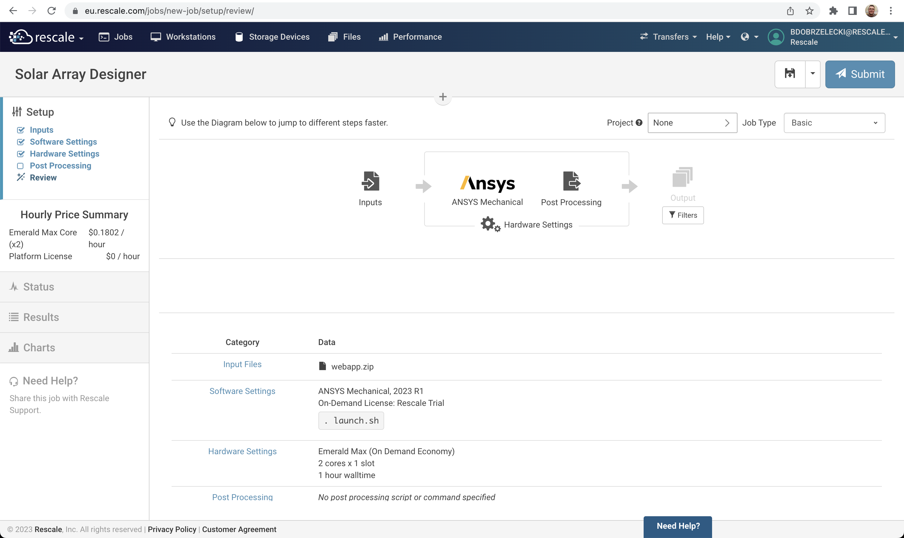
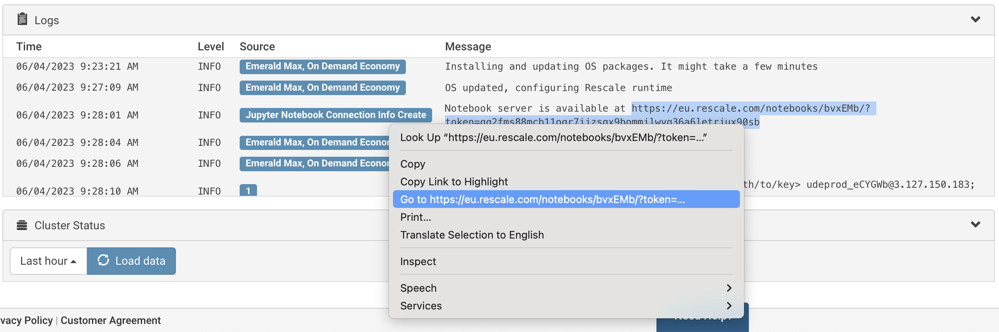
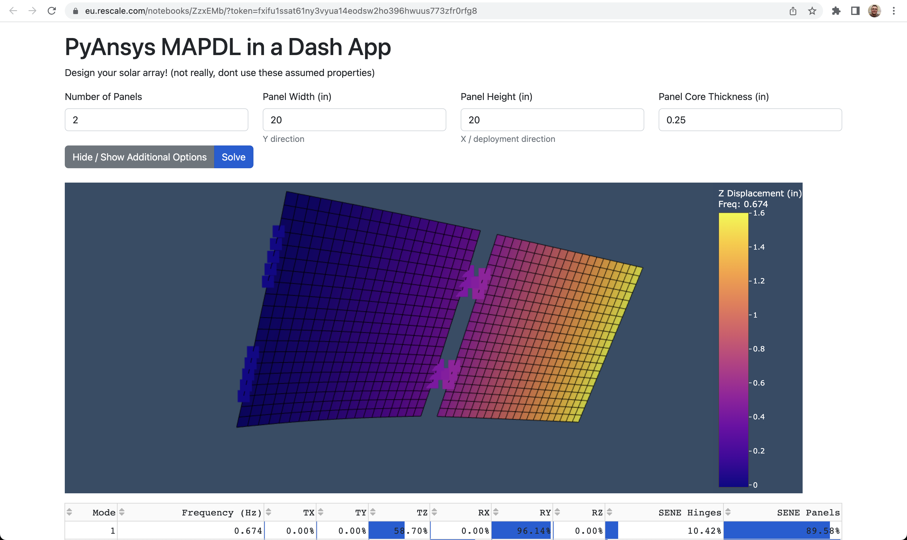

# Solar Array Designer

Solar Array Designer is a [Dash](https://dash.plotly.com/) web app created by Steve Kiefer for his [ANSYS in a Python Web App application](https://towardsdatascience.com/ansys-in-a-python-web-app-part-2-pre-processing-solving-with-pymapdl-50428c18f8e7) article. We have cloned the [original repository](https://github.com/shkiefer/pyAnsys_MAPDL_dash) and made a few changes to make it a Rescale App. The goal is to demonstrate how to port an existing Dash web app to Rescale.

We encourage you to read Steve's original article, which includes an in-depth walkthrough the application code.

For an introduction to Rescale Apps, see [Hello World Rescale App](https://github.com/rescale-labs/App_HelloWorld_Flask).

## Quick start

Currently, Rescale Apps rely on the `jupyter4all` flag which needs to be enabled for a user, a workspace, or a company. See the [Hello World](https://github.com/rescale-labs/App_HelloWorld_Flask) repository for details.

### Deploying a Rescale App as Job inputs

Packaging a Dash web app for deployment is straightforward. While inside the root directory of the cloned code repository, issue a zip command to create a web app archive. Create a new Job, upload the archive as inputs, select *ANSYS Mechanical* software tile, set `. launch.sh` as a command, select hardware with 2+ cores and submit.

```
❯ git clone https://github.com/rescale-labs/App_SolarArray_PyMAPDL_Dash
❯ cd App_SolarArray_PyMAPDL_Dash
❯ zip -r webapp.zip *
```

The review page of your Job should look like this.



Once started, look at the Job Logs section and search for the line mentioning the Notebook server. Highlight the link and open it in a new tab.



In the new tab with the Rescale App, click `Solve` to start calculation. Once finished, interact with the visualization to zoom, rotate, pan results overlaid on solar array geometry.



### Publishing a Rescale App using the Rescale Software Publisher

A Rescale App can be published as a separate software tile visible in the Rescale Portal. For a detailed description of the publication script, see the [Hello World Rescale App](https://github.com/rescale-labs/App_HelloWorld_Flask#publishing-a-rescale-app-using-the-rescale-software-publisher) repository.

Make sure Software Publisher is enabled for your organization, the `jupyter4all` flag is active (ask your Rescale contact) and the Rescale CLI is installed and configured.

Edit the [`sbub/build.sh`](spub/build.sh) and change the `ANALYSIS_CODE` to something unique, preferably using your organization's domain name (assuming `www.example.com`, use `com_example_app_solar_array_designer`). When ready, source the build script (see [`spub/spub_sample_output.out`](spub/spub_sample_output.out) for sample output of a successful publication):

```
❯ cd App_SolarArray_PyMAPDL_Dash/spub
❯ source build.sh

  adding: dist/ (stored 0%)
  adding: dist/requirements.txt (deflated 21%)
  adding: dist/app.py (deflated 79%)
  adding: dist/assets/ (stored 0%)
  adding: dist/assets/app_icon.png (deflated 3%)
  adding: dist/spub_launch.sh (deflated 33%)
2023-08-28 15:59:33,894 - Authenticated as bdobrzelecki@rescale.com
2023-08-28 15:59:33,916 - Sandbox: Syncing software
...
```

Once published, follow the usual steps to set up a basic Job.

* Create a new Job.
* When configuring Software Settings, select `Solar Array Designer`.
* Still in Software Settings, click on `+ Add Software` and add `ANSYS Mechanical`, remove all lines in the `Command` text box, uncheck `Validate Command` checkbox, and set the `License Options`.
* Specify Hardware Settings (2-core machine should be enough).
* Submit.

The process should be similar to the following recording:


## Porting Dash web applications to Rescale

The most important change, to a plain Dash application, is to set the new, prefixed, root route for the application. By default, it is set to `/`, so we need to let Dash Single Page Application (SPA) know from where to serve static content and handle API requests. We also need to configure the frontend code, running in a browser, to send prefixed requests back to the server side of a Dash application. This is done by passing `routes_pathname_prefix` and `requests_pathname_prefix` parameters to the `Dash()` app constructor.

The current `jupyter4all` hack requires prefixing with `/notebooks/` followed by a cluster ID that is extracted from the `RESCALE_CLUSTER_ID` environmental variable. The following code fragment extracted from [app.py](app.py) demonstrates required configuration changes.

```
PREFIX = f"/notebooks/{os.getenv('RESCALE_CLUSTER_ID')}/"

app = dash.Dash(
    __name__,
    long_callback_manager=lcm,
    external_stylesheets=[dbc.themes.BOOTSTRAP],
    routes_pathname_prefix=PREFIX,
    requests_pathname_prefix=PREFIX,
)
```

Additionally, the future Rescale App integration with the Rescale Portal, will require a discovery endpoint, which provides metadata about the app. This endpoint is expected to have the following address `${PREFIX}/.rescale-app`. Content returned from getting this resource is a JSON Rescale App metadata document.

An example of how to add this endpoint to a Dash web app is presented below (see [app.py](app.py)).

```
class RescaleAppDiscovery(Resource):
    def get(self):
        return {
            "name": "Solar Array Designer",
            "description": "An example of a Rescale App using ANSYS PyMAPDL module and the Dash web framework",
            "helpUrl": "https://github.com/rescale-labs/App_SolarArray_PyMAPDL_Dash",
            "icon": app.get_asset_url("app_icon.png"),
            "supportEmail": "support@rescale.com",
            "webappUrl": PREFIX,
            "isActive": True,
        }

server = app.server
api = Api(server)
api.add_resource(RescaleAppDiscovery, f"{PREFIX}/.rescale-app")
```

The [launch.sh](launch.sh) script applies the `jupyter4all` hack and starts the web app in a context of a gunicorn web server, which uses platform provided certificate and key files to ensure a secure HTTP connection between the app and the Rescale Platform. To find out more about how Rescale Apps work, see the [Hello World Rescale App](https://github.com/rescale-labs/App_HelloWorld_Flask) repository.